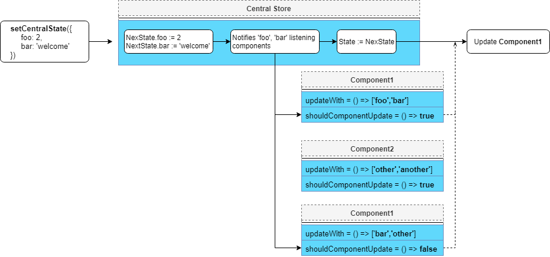

# react-central-state
Easy to use global state for React.  
Shared along all components, updating them only when needed.
No reducers, no actions, no providers.

## Installation

Requires react *16.4.0* or later

`npm install --save react-central-state`

## Getting Started
Just wrap your components with `CSComponent`
```javascript
import {CSComponent} from 'react-central-state'  
// or , if you want to operate the state on a non react-component class:

class Example extends React.Component{
...
}

export default CSComponent(Example);
```


Reading and updating the central state is pretty much like react's vanilla state:

```javascript
//Reading from state
this.centralState.SomeProperty
//Updating the state
this.setCentralState({foo:'bar'});
```

The only requirement it will add to your component is implementing the `updateWith` method:
```javascript
/*CSComponent wrapped react components need to implement this.
Should return an array of strings of central state's properties that would trigger an update on this component. Can be an empty array*/
updateWith(){
    return['foo','someOtherProperty','someOtherProperty2'];
}
```
### <b>That's pretty much it.</b>
&nbsp;
### Should Component Update?
Components wrapped with `CSComponent` have their `shoudComponentUpdate` injected with `nextCentralState` as third parameter:
```javascript
shoudComponentUpdate(nextProps,nextState,nextCentralState){
	//Do your thing
}
```

### Handling changes out of render
You can also subscribe callbacks to central state properties changes, with `addCentralStateListener` :

```javascript
//callback receives a snapshot of the previous state.
this.callback = function(prevState){
    let foo = this.centralState.foo;
    ...
};

//Pass the callback, with a central state property key, 
//that when changes value will invoke it.
this.addCentralStateListener(this.callback,'foo');
```

You probably want to unsubscribe on unmounting:
```javascript
componentWillUnmount(){
    this.removeCentralStateListener(this.callback);
    ...  
}
```

### Handling changes out of a React Component
The API also provides CSHandler, you can either extend or instantiate it, gaining access to:
`setCentralState()`, `addCentralStateListener()`, `removeCentralStateListener()`.

As well as reading from the state:
```javascript
const handler = new CSHandler();

function example(){
	handler.setCentralState({foo:'bar'})
	console.log(handler.centralState.foo) // -> 'bar'
}
```


## Update Flow
The store keeps updated info of the mounted components hierarchy, by analyzing their mounting/updating order.

When the state changes, components observing the changed properties are notified orderly and may update - if `shouldComponentUpdate` returns true.

<p align="center">
    
</p>


## Final notes

You can use react-central-state with react's vanilla state without conflict.